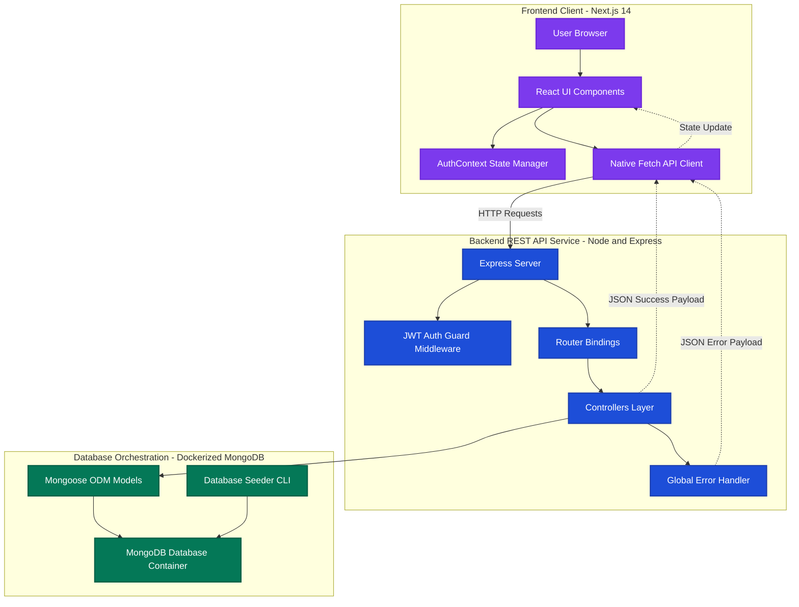
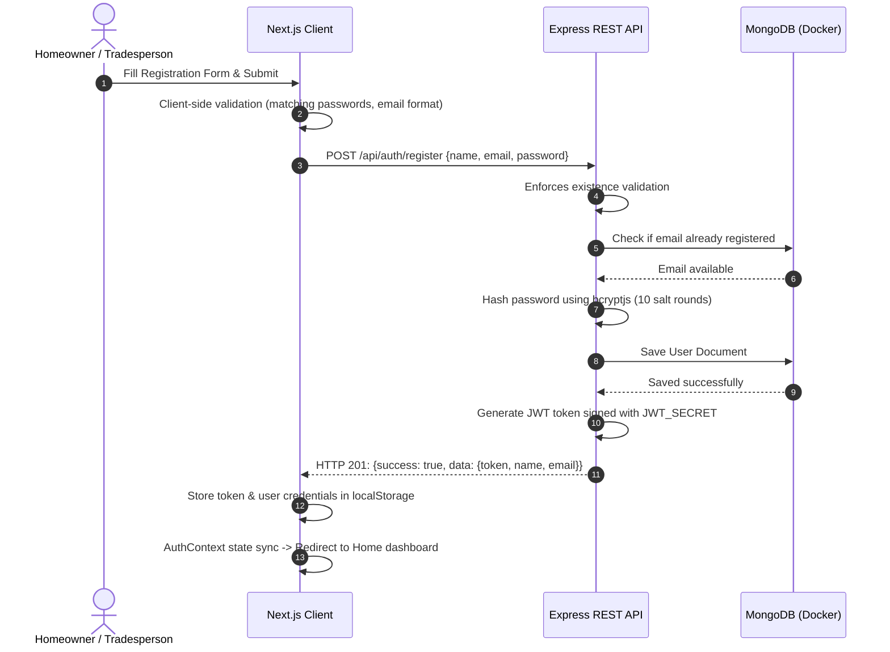
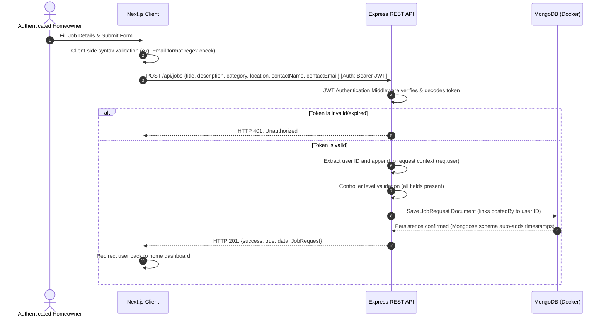
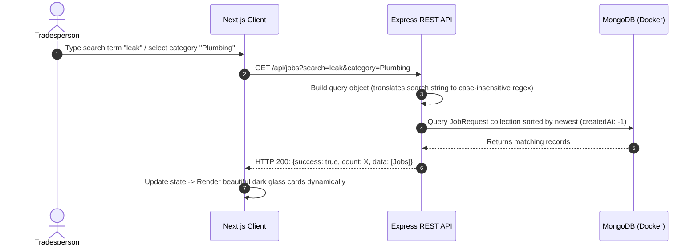
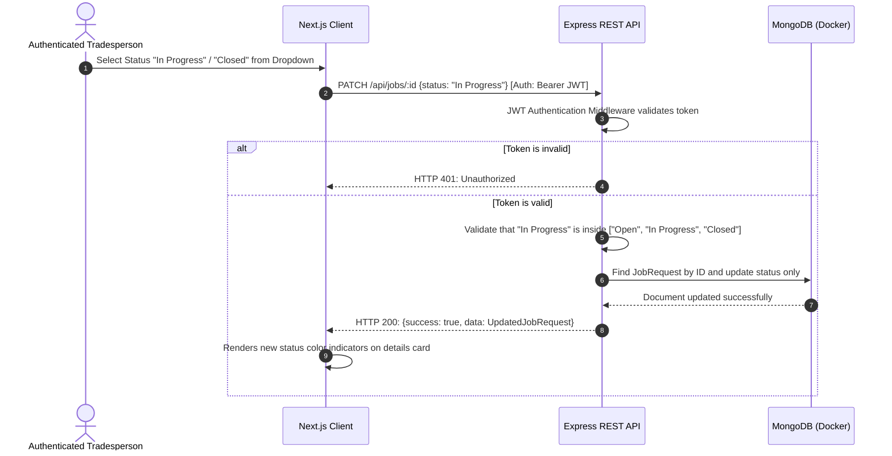

# Mini Service Request Board (GlobalTNA Assessment)

A high-performance, premium full-stack web application designed for homeowners to post service requests (e.g. plumbing, electrical, carpentry, painting) and tradespeople to search, filter, and track project status changes.

---

### 🌐 Live Production URLs

* **🖥️ Deployed Frontend Website**: [https://frontend-omega-six-h9ai2mbbnz.vercel.app](https://frontend-omega-six-h9ai2mbbnz.vercel.app)
* **🔌 Deployed Express REST API**: [https://backend-gamma-eight-77.vercel.app/api/jobs](https://backend-gamma-eight-77.vercel.app/api/jobs)

---

## 🌟 Key Features Implemented

1. **Clean Full-Stack Architecture**: Strictly separated client (`frontend`) and API server (`backend`) codebases.
2. **MongoDB Docker Integration**: Simplified local database orchestration via `docker-compose.yml` mapped to an isolated port to prevent host conflicts.
3. **Keyword Search (Bonus)**: Implemented regex keyword lookup in the `/api/jobs` query pipeline across `title` and `description`.
4. **JWT Authentication & Protection (Bonus)**: Complete sign-up, sign-in, and authorization flows. Only logged-in users can post new requests, transition job statuses, or delete jobs.
5. **Robust Integration Testing (Bonus)**: 14 test suites built with **Jest & Supertest** covering CRUD endpoints, filters, regex searches, data validation constraints, and auth guards.
6. **Database Seeding (Bonus)**: A single CLI command populates the database with a test user and 8 realistic, well-categorized jobs.
7. **Stunning Dark Glassmorphism UI**: High-fidelity dashboard utilizing **TailwindCSS v4**, custom visual indicators, animated loading states, responsive cards, and validation checks.

---

## 📁 Repository Structure

```text
mini_service_request_board/
├── docker-compose.yml        # Docker Compose configuration for local MongoDB
├── backend/                  # Express REST API codebase
│   ├── src/
│   │   ├── config/           # Database configuration
│   │   ├── controllers/      # Route controllers (Auth, Jobs)
│   │   ├── middleware/       # JWT protection, global error handler
│   │   ├── models/           # Mongoose schemas (User, JobRequest)
│   │   ├── routes/           # Routing bindings
│   │   └── app.js & server.js
│   ├── tests/                # Integration tests (Jest & Supertest)
│   ├── seed.js               # Database seeder script
│   └── package.json
└── frontend/                 # Next.js 14+ (App Router) codebase
    ├── src/
    │   ├── app/              # Routes, screens, and global themes
    │   ├── components/       # Reusable components (Navbar, Cards, Spinners)
    │   └── context/          # Global AuthContext API
    └── package.json
```

---

## 📊 System Architecture & Workflows

Below is the complete architectural layout and request-response lifecycle sequence diagrams for the Mini Service Request Board application.

### 📐 Structural Block Diagram



### 🔄 Request Lifecycle Workflows

#### 1. 🔐 User Registration & Session Initialization


#### 2. 🆕 Posting a Service Request (Homeowner)


#### 3. 🔍 Browsing, Filtering & Searching (Tradesperson)


#### 4. 🔄 Transitioning Job Status (Tradesperson)


---

## 🚀 Quick Start Guide

Follow these steps to run the complete stack locally in under 3 minutes:

### 1. Database Setup (Docker)
In the root directory, spin up the local MongoDB instance:
```bash
docker compose up -d
```
> **Note**: Mapped to port `27018` to avoid collision with any existing databases running on default port `27017` on your local system.

---

### 2. Backend Server Setup
Navigate into the `backend` folder and run the server:
```bash
cd backend
# Install dependencies
npm install

# Run database seeder (seeds 1 test user and 8 realistic jobs)
npm run seed

# Run the backend in development mode (nodemon)
npm run dev
```
The REST API will run on `http://localhost:5001`.

---

### 3. Frontend App Setup
Open a new terminal window in the root directory and run the frontend:
```bash
cd frontend
# Install dependencies
npm install

# Run the dev server
npm run dev
```
Open [http://localhost:3000](http://localhost:3000) in your browser.

---

## 🧪 Testing the API
We have provided comprehensive unit and integration tests. To run the test suites:
```bash
cd backend
npm test
```
*All 14 tests will run in an isolated test database container environment and output clear status results.*

---

## 🔌 API Endpoints

The API is fully documented and structured under the `/api` prefix. Private endpoints require a JSON Web Token (JWT) sent in the HTTP `Authorization` header.

### 🔑 Authentication Endpoints

| Endpoint | Method | Auth Required | Description | Request Body Example |
| :--- | :--- | :---: | :--- | :--- |
| `/api/auth/register` | `POST` | ❌ No | Registers a new user. | `{"name": "Jane Doe", "email": "jane@example.com", "password": "password123"}` |
| `/api/auth/login` | `POST` | ❌ No | Authenticates user and returns JWT. | `{"email": "jane@example.com", "password": "password123"}` |
| `/api/auth/me` | `GET` | 🔒 Yes | Retrieves current logged-in user profile. | *None (Sends JWT in Auth header)* |

### 🛠️ Job Request Endpoints

| Endpoint | Method | Auth Required | Description |
| :--- | :--- | :---: | :--- |
| `/api/jobs` | `GET` | ❌ No | Lists all jobs. Supports query filters (category, status, keyword search). |
| `/api/jobs/:id` | `GET` | ❌ No | Fetches a single job request by ID. |
| `/api/jobs` | `POST` | 🔒 Yes | Creates a new job request with fields validation. |
| `/api/jobs/:id` | `PATCH` | 🔒 Yes | Updates **only** the status of a job. |
| `/api/jobs/:id` | `DELETE` | 🔒 Yes | Deletes a job request by ID. |

---

#### 📌 Endpoint Details & Payload Specs

### 🔑 Authentication Endpoints

#### 1. 🔍 Register a New User
* **Method & Path**: `POST http://localhost:5001/api/auth/register`
* **Example curl Request**:
  ```bash
  curl -X POST http://localhost:5001/api/auth/register \
    -H "Content-Type: application/json" \
    -d '{
      "name": "Jane Doe",
      "email": "jane@example.com",
      "password": "password123"
    }'
  ```

#### 2. 🔑 Authenticate (Login) User
* **Method & Path**: `POST http://localhost:5001/api/auth/login`
* **Example curl Request**:
  ```bash
  curl -X POST http://localhost:5001/api/auth/login \
    -H "Content-Type: application/json" \
    -d '{
      "email": "jane@example.com",
      "password": "password123"
    }'
  ```

#### 3. 👤 Get Current User Profile (Private)
* **Method & Path**: `GET http://localhost:5001/api/auth/me`
* **Headers**: `Authorization: Bearer <your_jwt_token>`
* **Example curl Request**:
  ```bash
  curl -X GET http://localhost:5001/api/auth/me \
    -H "Authorization: Bearer <your_jwt_token>"
  ```

---

### 🛠️ Job Request Endpoints

#### 1. 🔍 List & Filter Service Requests
* **Method & Path**: `GET http://localhost:5001/api/jobs`
* **Query Parameters**:
  * `category` *(Optional)*: Filter by job category. Supported: `Plumbing`, `Electrical`, `Painting`, `Joinery`, `Gardening`, `Cleaning`, `Other`.
  * `status` *(Optional)*: Filter by job status. Supported: `Open`, `In Progress`, `Closed`.
  * `search` *(Optional)*: Keyword search against `title` and `description` fields (case-insensitive regex search).
* **Example curl Request**:
  ```bash
  curl -X GET "http://localhost:5001/api/jobs?category=Plumbing&status=Open&search=leak"
  ```

#### 2. 📄 Get Single Job Details by ID
* **Method & Path**: `GET http://localhost:5001/api/jobs/:id`
* **Example curl Request**:
  ```bash
  curl -X GET http://localhost:5001/api/jobs/65f123456789abcdef012345
  ```

#### 3. 🆕 Create a Service Request (Private)
* **Method & Path**: `POST http://localhost:5001/api/jobs`
* **Headers**: `Authorization: Bearer <your_jwt_token>`
* **Example curl Request**:
  ```bash
  curl -X POST http://localhost:5001/api/jobs \
    -H "Content-Type: application/json" \
    -H "Authorization: Bearer <your_jwt_token>" \
    -d '{
      "title": "Fix leaking bathroom faucet",
      "description": "The master bathroom faucet is dripping continuously and needs a washer replacement.",
      "category": "Plumbing",
      "location": "London, UK",
      "contactName": "John Doe",
      "contactEmail": "john@example.com"
    }'
  ```

#### 🔄 Update Job Status (Private)
* **Method & Path**: `PATCH http://localhost:5001/api/jobs/:id`
* **Headers**: `Authorization: Bearer <your_jwt_token>`
* **Example curl Request**:
  ```bash
  curl -X PATCH http://localhost:5001/api/jobs/65f123456789abcdef012345 \
    -H "Content-Type: application/json" \
    -H "Authorization: Bearer <your_jwt_token>" \
    -d '{
      "status": "In Progress"
    }'
  ```
  *(Status must be one of: `Open`, `In Progress`, `Closed`)*

#### 🗑️ Delete Service Request (Private)
* **Method & Path**: `DELETE http://localhost:5001/api/jobs/:id`
* **Headers**: `Authorization: Bearer <your_jwt_token>`
* **Example curl Request**:
  ```bash
  curl -X DELETE http://localhost:5001/api/jobs/65f123456789abcdef012345 \
    -H "Authorization: Bearer <your_jwt_token>"
  ```

---

## ⚙️ Environment Variables

### Backend (`backend/.env`)
Create a `.env` file inside the `backend` directory:
```env
PORT=5001

# MONGODB_URI - Choose depending on your execution environment:
# 1. Local Development (using Docker Compose MongoDB):
MONGODB_URI=mongodb://127.0.0.1:27018/service-request-board

# 2. Production (using MongoDB Atlas Cloud Cluster):
# MONGODB_URI=mongodb+srv://<username>:<password>@cluster0.cxow04v.mongodb.net/service-request-board?retryWrites=true&w=majority

JWT_SECRET=
NODE_ENV=
```

### Frontend (`frontend/.env.local`)
Create a `.env.local` file inside the `frontend` directory:
```env
NEXT_PUBLIC_API_URL=http://localhost:5001/api
```

---

## 🤝 Seed Credentials
If you wish to log in on the frontend to post, update, or delete requests, use the pre-seeded credentials:
- **Email**: `john@example.com`
- **Password**: `password123`
